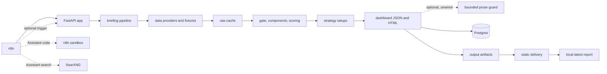

# Briefing App

Options-first trading briefing application that loads a configured universe, validates
market-data sources, computes component scores and strategy setups, then publishes
auditable dashboard artifacts. The shipped local scheduler is `launchd`; Python owns the
pipeline and static publishing path. n8n remains available as an optional/manual workflow
runner.

## Tech Stack

- Python 3.14
- FastAPI and Uvicorn
- Pydantic and PyYAML
- SQLAlchemy, psycopg, and Postgres
- pandas, NumPy, and SciPy
- Jinja2 dashboard rendering
- Bounded LLM prose guardrails are present but deliberately unwired for the local release
- Docker Compose for optional local app, Postgres, n8n, sandbox, and SearXNG
- SearXNG for local n8n Assistant web search
- pytest for tests

## Architecture



See [Architecture Design](docs/architecture/ARCHITECTURE.md) for the folder organization and more
detail.

## Main Folders

- `src/briefing_app/`: application code.
- `config/`: example runtime configuration and source registry.
- `docs/`: documentation for people to read — product, architecture, research, operations.
- `tasks/`: work for agents to execute — lane documents, file ownership, verification results.
- `ops/`: local operational scripts.
- `workflows/`: n8n workflow exports and runbooks.
- `migrations/`: Postgres schema migrations.
- `schemas/`: manual capture schemas.
- `tests/`: pytest suite.
- `data/`: raw cache.
- `output/`: generated dashboard and delivery artifacts.

## Project Docs

Documentation is split by who reads it and what they do with it. Full map:
**[`docs/README.md`](docs/README.md)**.

| Looking for | Go to |
|---|---|
| The traps a fresh session cannot infer from the code | [`HANDOFF.md`](HANDOFF.md) — **start here** |
| Why something was decided, and what was rejected | [`docs/architecture/decisions/`](docs/architecture/decisions/) |
| What is being built right now, and who owns which file | [`tasks/README.md`](tasks/README.md) |
| What the report is meant to say | [`docs/product/`](docs/product/) |
| How the system is put together | [`docs/architecture/ARCHITECTURE.md`](docs/architecture/ARCHITECTURE.md) |
| Why a run reported `partial` | [`docs/architecture/RUN-HEALTH.md`](docs/architecture/RUN-HEALTH.md) |
| Whether a data source works, or was already investigated | [`docs/research/`](docs/research/) |
| How to run, back-fill or deploy it | [`docs/operations/`](docs/operations/) |
| Something that used to be true | [`docs/archive/README.md`](docs/archive/README.md) |

## Local Run

For the local release, use the ops scripts:

```bash
cp .env.example .env
PYTHONPATH=src .venv/bin/python ops/run_daily.py --data-mode live --force --max-tickers 1
PYTHONPATH=src .venv/bin/python ops/status.py
```

The stable report path is:

```text
output/published/latest/dashboard.html
```

Useful commands:

```bash
PYTHONPATH=src .venv/bin/python -m briefing_app.cli preflight
PYTHONPATH=src .venv/bin/python -m briefing_app.cli run-daily --force --max-tickers 1
PYTHONPATH=src .venv/bin/python -m briefing_app.cli run-daily --data-mode live --force --max-tickers 1
PYTHONPATH=src .venv/bin/python ops/run_daily.py --data-mode live --force --max-tickers 1
PYTHONPATH=src .venv/bin/python -m briefing_app.cli backfill-iv --dry-run
PYTHONPATH=src .venv/bin/python ops/audit_dashboard.py output/published/latest/dashboard.json
PYTHONPATH=src .venv/bin/python -m pytest
```

`pipeline.data_mode: fixture` remains the default for deterministic local runs. Use
`live` after configuring provider credentials; the run pulls CBOE delayed option chains
and uses FMP, Twelve Data, Finnhub, FRED, FINRA, SEC EDGAR and Alpha Vantage fallbacks
when those keys or public feeds are present.

Optional Docker/n8n stack:

```bash
docker compose up -d --build
```

Then open `http://127.0.0.1:8000/health` or `http://127.0.0.1:5678`.

### Reading the graded ideas table

The dashboard opens on a table of trading ideas, each carrying a conviction score and a
certainty grade. Read it from the JSON artifact with:

```bash
jq -r '.trading_ideas[]
  | [.status, .ticker, .grade_letter, .grade_score, .thesis_band, .blocked_reason]
  | @tsv' output/dashboard/$(date +%F)/dashboard.json | column -t -s$'\t'
```

The grade is ALIGN: `100 * alignment`, less visible penalties. Alignment comes from
`S_CTE` and the setup direction. `P(thesis band)` is still printed as scenario context,
but contributes zero points to the grade. The confidence tier caps the displayed letter,
not the numeric score: Tier A can show `A+`, Tier B stops at `B+`, and Tier C stops at
`C`. Numeric `grade_score` keeps full resolution for sorting.

Rows are ordered by actionability first: `TRADEABLE`, then `WATCHLIST`, then `BLOCKED`,
then `UNSCORED`. Grade descending is the tie-break inside each status bucket, so a lower
grade executable setup appears ahead of a higher-grade setup that cannot be traded today.

The table shows two measurements, not one. **Conviction** is the uncapped 0-100 score of
how strongly the evidence supports the declared idea; **certainty** is the letter that caps
how far data quality lets that conviction be trusted. A row reading `100.0` and `C` is a
high-support idea with a low confidence ceiling, not a contradiction. Beside them,
**thesis** is the direction declared in the universe config and **data reads** is the
composite posture the model computed independently; when the two disagree the row is
explicitly marked, because the tool falsifying a declared thesis is a result rather than an
error. See [REPORT-LAYOUT.md](docs/product/REPORT-LAYOUT.md).

Directional theses use the favorable side of spot (`above spot` / `below spot`), not the
one-sigma breakout tail. Volatility theses still use the sigma bands directly.

Rows that were never scored carry `grade_letter: null` rather than a low grade: a name the
pipeline could not score is listed so its absence is visible, not graded on partial data.
Every non-`TRADEABLE` row states why in `blocked_reason`.

Every run records the mode it actually ran in — `data_mode` in the run status file, in
`dashboard.json`, in the `briefing_run` details column, and in the dashboard header — taken
from the data source that ran rather than from the requested setting, so an explicit
`--data-mode` or an injected data source cannot mislabel a run. Fixture rows are labelled
`synthetic`, never `verified`, which floors the required `S_O` to Tier C: **a fixture run
can produce a dashboard but never a tradeable call.** Fixture mode also refuses to feed any
leg the live path has no source for (`LIVE_UNSCORABLE_LEGS` in `pipeline.py`) — today
`executive_tone` and the risk-reversal history — so a leg that scores in fixture mode is
one that can score live. Non-live runs are refused at the `daily_snapshot` persistence
boundary, so synthetic IV and put/call rows cannot contaminate the live baseline.

### Run health and honest status

A run that reached no providers used to report `succeeded` with zero diagnostics, because
per-ticker problems accumulated in a local list that never reached the run status. They do
now, classified by severity: a warm-up baseline still building is `normal` and leaves the
run `succeeded`; a payload that arrived unusable is `degraded`; a source that was never
reached is an `outage`. Anything above `normal` reaches the run diagnostics and marks the
run `partial` through the status rule that already existed. Diagnostics are aggregated, so
eighteen names missing prices is one line naming the eighteen rather than eighteen lines.

Every run also publishes a completeness summary — components scored of components defined,
names scored of names gated, and which providers answered — which the report renders as a
banner at the top when the run is `partial`. A run where no provider answered at all gets
distinct, stronger wording. A healthy run shows no banner. The severity of all 36 recording
points is tabulated in [RUN-HEALTH.md](docs/architecture/RUN-HEALTH.md), and a newly added recording
point fails the suite until it is classified.

### Live mode and provider plans

Live runs are shaped by what each key is actually entitled to, which is not the same as
what each provider documents:

- **Request budgets are enforced before a call is sent.** A free Alpha Vantage key allows
  25 requests a day; spending it silently is what previously made live runs fragile.
  Budgets are persisted per provider per day under
  `$BRIEFING_DATA_DIR/provider_budget/` and tuned with `ALPHA_VANTAGE_DAILY_REQUEST_BUDGET`,
  `FMP_DAILY_REQUEST_BUDGET`, and `TWELVE_DATA_DAILY_REQUEST_BUDGET`. Historical
  Alpha Vantage put/call history is no longer scheduled; P/C baselines are self-built
  from persisted option snapshots. Finnhub adds up to 2 requests per ticker but publishes
  no daily cap — only a per-minute rate — so it is paced rather than
  budgeted. Twelve Data backs up price history only when FMP gates a symbol; its Basic
  plan is budgeted at 800 requests/day and paced at 8 credits/minute.
- **Local runs persist by default even without Postgres.** If `DATABASE_URL` is unset and
  `BRIEFING_LOCAL_SQLITE` is not `0`, `false`, or `no`, the pipeline creates
  `$BRIEFING_DATA_DIR/briefing.sqlite3`. That lets the self-built IV and put/call
  baselines warm up during ordinary local live runs. Set `BRIEFING_LOCAL_SQLITE=0` to
  keep the old no-database behavior.
- **IV backfill is resumable, and guarded twice.** `briefing_app.cli backfill-iv` replays
  historical option chains for gate-accepted US names, skips already stored sessions, and
  builds rows through the same option-structure path as live runs — proved by
  `tests/test_backfill.py::test_backfill_reproduces_a_row_the_live_path_stored`, which
  reproduces a stored live row field for field. Two guards stand in front of it. It
  reserves the daily run's request allowance and spends only the surplus, so a backfill
  cannot starve the live run (`--live-run-reserve`). And it refuses to write when its
  chains come from a different vendor than the live path's, because an IV rank is a
  percentile of one series and splicing two vendors reports a confident wrong answer
  (`--allow-vendor-splice` overrides, deliberately). Note that Alpha Vantage
  `HISTORICAL_OPTIONS` is **not on the free tier** — it answers HTTP 200 with a sample
  payload that validates as `synthetic` — so a free key cannot complete a backfill at any
  speed. See [IV-BACKFILL.md](docs/operations/IV-BACKFILL.md).
- **Premium endpoints are refused up front** when `ALPHA_VANTAGE_PLAN`, `FMP_PLAN`, or
  `TWELVE_DATA_PLAN` is `free`, so a metered key is never spent being told no. An endpoint
  that turns out to be plan-gated at runtime is recorded in
  `provider_budget/<provider>/plan_gated.json` and not retried; delete that file to
  re-probe after upgrading a plan.
- **A refusal is never scored as zero.** A plan gate, a spent budget, a throttle, and an
  empty body each land in the evidence ledger with their own status, and the affected
  component is re-weighted as unavailable.

Free-plan coverage on the current keys, as measured rather than as documented:

- **Alpha Vantage is not treated as dead.** It remains a metered fallback where useful,
  but the scheduled `HISTORICAL_PUT_CALL_RATIO` path was removed because it contributes
  nothing over self-built P/C baselines and spends the 25/day budget. See
  `docs/research/SOURCE_STATUS.md`.
- **FMP** serves price history, earnings calendar, analyst and price-target consensus, the
  congressional disclosure feeds and macro indicators — but only for a subset of symbols
  (AAPL, MSFT, NVDA, LMT and SPY answer; AVGO, ORCL, MU, QQQ, CRWV and AMAT return HTTP
  402). Its dated economic calendar, news, insider and institutional endpoints are
  plan-gated.
- **Twelve Data** is wired as the price-history fallback after FMP and before Alpha
  Vantage. It covers AVGO, ORCL, MU, QQQ, CRWV and AMAT on the verified key; RHM.DE and
  LDO.MI remain paid-plan gated.
- **Primary records lead where one exists**: SEC EDGAR Form 4 for `S_I`, FRED for `S_M`,
  FINRA's consolidated file for the borrow proxy, CBOE for the options chain.
- **`S_M` requires declared sector exposure.** The shipped example config now covers every
  sector in the 24-ticker live report and normalizes `Defense`; an undeclared sector still
  scores `S_M` as `n/a` by design.
- **Finnhub** serves company news and analyst recommendation trends. Its free tier is a
  rate limit (60/min) rather than a daily allowance, and it is **US-only** — an
  exchange-suffixed symbol is refused before a request is sent. It does not score its own
  news, so tone is derived locally by `providers/news_tone.py` and labelled `local tone`
  rather than passed off as a vendor score.
- **`S_F` (institutional) is declared permanently `n/a`** (Q4). It was blocked by design
  rather than by wiring — `docs/research/alternatives/pb1-13f-blocker.md` — and closing it properly
  needs a curated filer universe, a table and a two-quarter diff for 0.10 of the US weight.
  Nothing is fetched for it, in either run mode, so nothing is spent; its weight is
  redistributed across the components that did score. The reason travels with the run in
  `pipeline.DECLARED_UNSCORABLE_COMPONENTS`. Note that `S_F` is in the required set for
  expression classes `P` and `S`, so both stay Tier C while this stands; the shipped
  config enables only `V` and `E`.

Local operations and scheduler setup: [LOCAL-OPS.md](docs/operations/LOCAL-OPS.md).
Optional local+n8n setup: [HOW_TO_RUN_WITH_N8N.md](workflows/HOW_TO_RUN_WITH_N8N.md).
Optional n8n Assistant setup: [N8N_ASSISTANT_SETUP.md](workflows/N8N_ASSISTANT_SETUP.md).

For the local n8n Assistant sandbox dialog, use:

```text
Service URL: http://sandbox-api:8080
API key: value of N8N_SANDBOX_SERVICE_API_KEY in .env
```

For the local n8n Assistant web search dialog, select SearXNG and use:

```text
Instance URL: http://searxng:8080
```

## Deploy

The release target is local, single-reader operation on this machine. Hosted deployment is
retained as an option, not the current shipping path.

- Fly.io app deployment: [DEPLOY_FLY_IO.md](docs/operations/DEPLOY_FLY_IO.md)
- n8n Cloud workflow setup: [HOW_TO_RUN_WITH_N8N_CLOUD.md](workflows/HOW_TO_RUN_WITH_N8N_CLOUD.md)
- Deployment and orchestration options: [DEPLOYMENT_OPTIONS.md](docs/operations/DEPLOYMENT_OPTIONS.md)

## n8n

- Local n8n guide, optional/manual: [HOW_TO_RUN_WITH_N8N.md](workflows/HOW_TO_RUN_WITH_N8N.md)
- n8n Assistant guide: [N8N_ASSISTANT_SETUP.md](workflows/N8N_ASSISTANT_SETUP.md)
- n8n Cloud guide, archived hosted reference: [HOW_TO_RUN_WITH_N8N_CLOUD.md](workflows/HOW_TO_RUN_WITH_N8N_CLOUD.md)
