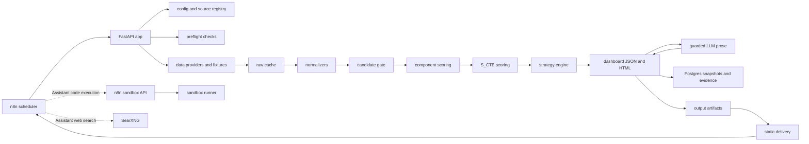

# Architecture Design

## Purpose

The briefing app is an options-first trading briefing pipeline that can run locally or
on a hosted FastAPI service. Python owns data ingestion, validation, scoring, setup
rules, dashboard rendering, and guarded LLM prose. n8n schedules the workflow and
calls the FastAPI app over HTTP.

## Overall Flow



## Runtime Components

- `app`: FastAPI and CLI service that runs the briefing pipeline.
- `postgres`: persistent snapshots, evidence ledger, component scores, setup signals,
  and run status.
- `n8n`: schedule, manual trigger, retry, delivery coordination, and notification path.
- `sandbox-certs`: one-shot certificate bootstrap for the n8n Assistant sandbox stack.
- `sandbox-api`: internal API used by n8n Assistant code sandbox setup.
- `sandbox-runner-1`: privileged Docker-in-Docker runner used by the Assistant sandbox.
- `searxng`: internal web search service used by the n8n Assistant.
- `data/raw`: date-stamped raw provider payloads before normalization.
- `output`: generated dashboards, preflight reports, and published static artifacts.

The Assistant sandbox and SearXNG services are optional local n8n Assistant support.
They are not part of the deterministic briefing pipeline and are not needed for the
imported daily or weekly workflows to execute.

## Folder Organization

```text
.
├── config/                  # Runtime examples: universe, candidates, source registry
├── data/                    # Raw provider cache written by pipeline/preflight
├── docs/                    # Architecture and project documentation
├── migrations/              # Postgres schema migrations
├── output/                  # Generated dashboards, reports, and published artifacts
├── schemas/                 # Manual capture schemas, currently EU options CSV
├── src/briefing_app/        # Application package
├── tests/                   # Pytest suite
├── workflows/               # n8n workflow exports and n8n runbooks
├── Dockerfile               # FastAPI app image
├── docker-compose.yml       # Local app, Postgres, n8n, sandbox, and SearXNG stack
├── searxng-settings.yml     # Local SearXNG config with JSON output enabled
├── implementation-tasks.md  # Task backlog and implementation plan
└── options-briefing-system-plan.md
```

## Application Package

```text
src/briefing_app/
├── api.py                   # FastAPI endpoints: health, run, delivery, preflight
├── cli.py                   # CLI entry points for local runs and preflight
├── config.py                # Typed YAML config loader
├── pipeline.py              # End-to-end daily/weekly orchestration
├── settings.py              # Environment-backed app settings
├── source_registry.py       # Source registry loader
├── raw_cache.py             # Raw payload cache path and replay helpers
├── provider_validation.py   # Provider error/status validation
├── storage.py               # Postgres persistence layer
├── delivery.py              # Static dashboard publishing
├── components/              # Macro, sentiment, insider, institutional scoring inputs
├── dashboard/               # Dashboard models, renderer, prompts, LLM guardrails
├── models/                  # Shared candidate, gate, market data, scoring models
├── options/                 # Options math and structure calculations
├── providers/               # Alpha Vantage, CBOE, FMP, FINRA, SEC, manual providers
├── strategy/                # Setup rules, scenarios, invalidation, leverage checks
└── universe/                # Candidate loading, gate, rendering, and gate history
```

## Data Boundaries

- Providers and fixtures write raw payloads before parsing.
- Normalizers convert raw payloads into typed market models.
- Components compute sourced sub-scores; unavailable data stays `n/a`, not zero.
- Scoring combines components into `S_CTE`.
- Strategy rules consume scores and options metrics to produce candidate setups.
- Dashboard JSON/HTML is deterministic and audit-oriented.
- LLM prose is optional and guarded: it may rewrite bounded prose but cannot introduce
  unauthorized numbers.

## External Integrations

- Market data: Alpha Vantage, CBOE, FMP, FINRA, SEC EDGAR, manual captures.
- LLM prose: Ollama Cloud by default, with OpenAI and Anthropic wrappers still present.
- Scheduling: n8n local or n8n Cloud.
- Local n8n Assistant: optional local Ollama model connector, n8n sandbox service, and
  SearXNG web search.
- Hosted app deployment: Fly.io is the documented path for running the FastAPI app
  outside the local Docker Compose stack.
- Persistence: Postgres through SQLAlchemy/psycopg.

## Related Docs

- Local n8n runbook: [HOW_TO_RUN_WITH_N8N.md](../workflows/HOW_TO_RUN_WITH_N8N.md)
- n8n Assistant setup: [N8N_ASSISTANT_SETUP.md](../workflows/N8N_ASSISTANT_SETUP.md)
- Deployment options: [DEPLOYMENT_OPTIONS.md](DEPLOYMENT_OPTIONS.md)
- Source status: [SOURCE_STATUS.md](SOURCE_STATUS.md)
