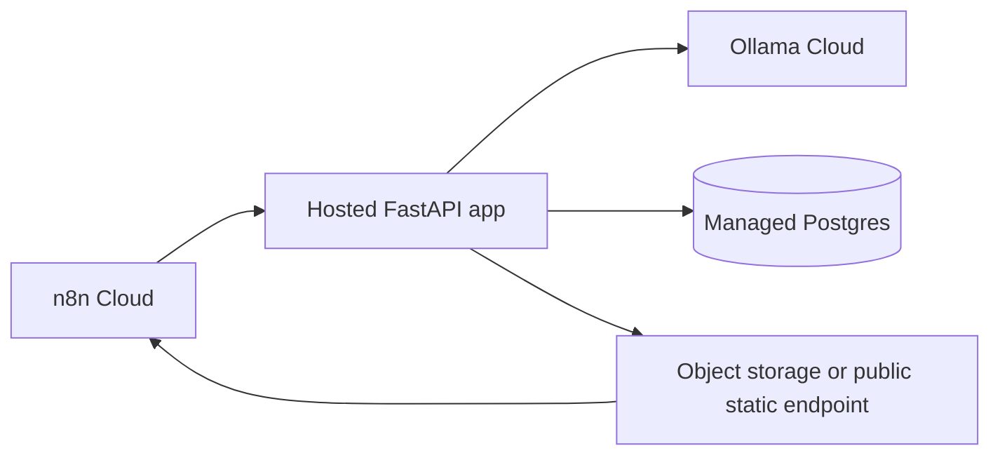

# Deployment And Orchestration Options

## Short Answer

The app can run locally or hosted. n8n can orchestrate it, but n8n does not host the
FastAPI app.

Recommended hosted setup:



## Option 1: Local Docker Compose

Use this for development.

- Runs FastAPI, Postgres, n8n, n8n Assistant sandbox, and SearXNG locally.
- n8n calls Docker service URLs such as `http://app:8000`.
- Assistant local URLs work only inside this Docker Compose network.

Main guide: [HOW_TO_RUN_WITH_N8N.md](../workflows/HOW_TO_RUN_WITH_N8N.md).

## Option 2: n8n Cloud + Hosted FastAPI App

Use this when you do not want your laptop involved in the daily run.

- n8n Cloud hosts the workflow editor and scheduler.
- The FastAPI app must be deployed somewhere public, for example Fly.io, Render,
  Railway, DigitalOcean, AWS, GCP, Azure, or a VPS.
- n8n Cloud calls public HTTPS URLs such as
  `https://<app>.fly.dev/run/daily`.
- The hosted app calls Ollama Cloud.
- Use managed Postgres and public artifact delivery for production.

Guides:

- [HOW_TO_RUN_WITH_N8N_CLOUD.md](../workflows/HOW_TO_RUN_WITH_N8N_CLOUD.md)
- [DEPLOY_FLY_IO.md](DEPLOY_FLY_IO.md)
- [SOURCE_STATUS.md](SOURCE_STATUS.md)

## Option 3: LangChain Or LangGraph

This is possible, but not the recommended first path for this project.

Use LangChain or LangGraph only as an orchestrator that calls the existing FastAPI
endpoints:

```text
POST /run/daily
POST /run/weekly
POST /delivery/static
```

Keep the trading logic inside the Python app:

- Provider validation.
- Raw cache.
- Options math.
- Component scores.
- Tiering.
- Strategy rules.
- Evidence ledger.
- LLM numeric guardrails.

Do not move trading scores or setup rules into an agent prompt. The app should remain
the deterministic execution engine.

## What Not To Do

- Do not expect n8n Cloud to reach `http://app:8000`, `http://sandbox-api:8080`,
  `http://searxng:8080`, or `host.docker.internal`.
- Do not expose the local sandbox runner to the public internet.
- Do not put `OLLAMA_API_KEY` in n8n unless you intentionally call Ollama directly from
  an n8n node.
- Do not rely on container file paths as public dashboard links in production.

## Recommended Production Path

1. Deploy the FastAPI app to Fly.io.
2. Set `APP_RUN_TOKEN` and `OLLAMA_API_KEY` as Fly secrets.
3. Use managed Postgres.
4. Add object storage or public static file serving for dashboard artifacts.
5. Import the workflow into n8n Cloud.
6. Replace local Docker URLs with public HTTPS app URLs.
7. Store the app bearer token as an n8n credential.
8. Run manually once with `force=true&max_tickers=1`.
9. Run preflight and review source statuses.
10. Activate the weekday schedule after the manual run succeeds.
