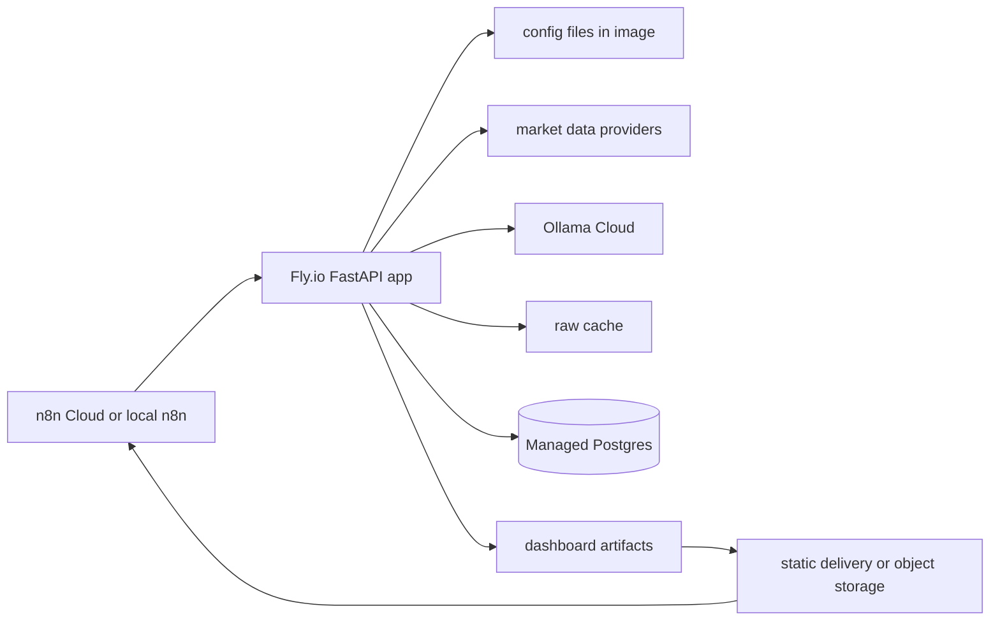

# Deploy To Fly.io And n8n

This guide deploys the FastAPI briefing app to Fly.io and uses n8n to trigger it.

Recommended shape:



## Important Current Limitation

`POST /delivery/static` publishes files inside the app host, for example under
`output/published/latest/`. On Fly.io those paths are server/container paths, not public
URLs. For production delivery, add one of these:

- Fly Volume for persistent internal files plus a future static-serving endpoint.
- Object storage delivery, for example S3, Cloudflare R2, GCS, or Azure Blob Storage.
- Email/Discord/Slack notification from n8n using returned run status until public
  dashboard URLs exist.

## Prerequisites

- Fly.io account.
- `flyctl` installed and authenticated.
- Dockerfile already present in this repo.
- Ollama Cloud API key.
- Optional market-data keys for live data.
- Optional Postgres client locally if you want to run migrations against Fly Managed
  Postgres.

## 1. Verify Locally First

```bash
cp .env.example .env
docker compose up -d --build
curl http://localhost:8000/health
```

Run a forced fixture check:

```bash
TOKEN=<same-value-as-APP_RUN_TOKEN>

curl -X POST \
  -H "Authorization: Bearer $TOKEN" \
  "http://localhost:8000/run/daily?force=true&max_tickers=1"
```

Full local+n8n steps are in
[How To Run The Briefing App With n8n](../../workflows/HOW_TO_RUN_WITH_N8N.md).

## 2. Create The Fly App

From the repository root:

```bash
fly auth login
fly launch --no-deploy --dockerfile Dockerfile
```

Use `--no-deploy` so you can check `fly.toml` before the first deploy.

In the generated `fly.toml`, make sure the web service points at port `8000` because
the Dockerfile runs Uvicorn on that port:

```toml
[build]
  dockerfile = "Dockerfile"

[env]
  APP_ENV = "production"
  BRIEFING_CONFIG_PATH = "/app/config/config.example.yaml"
  BRIEFING_SOURCE_REGISTRY_PATH = "/app/config/source_registry.yaml"
  BRIEFING_DATA_DIR = "/app/data"
  BRIEFING_OUTPUT_DIR = "/app/output"
  BRIEFING_HTTP_TIMEOUT_SECONDS = "10"
  BRIEFING_USER_AGENT = "briefing-app/0.1 contact@example.com"
  GENERIC_TIMEZONE = "Europe/Lisbon"
  LLM_PROVIDER = "ollama"
  OLLAMA_BASE_URL = "https://ollama.com"
  OLLAMA_MODEL = "gpt-oss:120b"

[http_service]
  internal_port = 8000
  force_https = true
  auto_stop_machines = "stop"
  auto_start_machines = true
  min_machines_running = 0
```

Use `min_machines_running = 1` instead if you want the app kept warm for scheduled
morning runs.

## 3. Set Secrets

Do not put secrets in `fly.toml`.

```bash
fly secrets set \
  APP_RUN_TOKEN="<long-random-token>" \
  OLLAMA_API_KEY="<ollama-cloud-api-key>"
```

Optional live-data keys:

```bash
fly secrets set \
  ALPHA_VANTAGE_API_KEY="<alpha-vantage-key>" \
  FMP_API_KEY="<fmp-key>" \
  FRED_API_KEY="<fred-key>" \
  FINNHUB_API_KEY="<finnhub-key>" \
  TWELVE_DATA_API_KEY="<twelve-data-key>"
```

## 4. Choose Persistence

For a smoke deploy, you can skip Postgres and volumes. The app will still run fixture
pipelines, but run history will not be persisted to Postgres and generated files may be
lost on redeploy or restart.

For production, use Managed Postgres and durable artifact storage.

### Managed Postgres

Create a Fly Managed Postgres cluster:

```bash
fly mpg create --name briefing-db --region lhr
fly mpg list
```

Attach it to the app. This sets `DATABASE_URL` on the app:

```bash
fly mpg attach <cluster-id> -a <fly-app-name>
```

Run the SQL migrations from your machine through a Fly proxy:

```bash
fly mpg proxy <cluster-id> --local-port 15432
```

In a second terminal, use the database connection string from the Fly dashboard, replace
the host with `localhost` and the port with `15432`, then run:

```bash
psql "postgres://fly-user:<password>@localhost:15432/fly-db" \
  -f migrations/001_init.sql \
  -f migrations/002_t3_storage.sql
```

### Persistent Files

If you want raw cache and dashboard files to survive restarts, create a Fly Volume:

```bash
fly volumes create briefing_data --region lhr --size 1 -a <fly-app-name>
```

Then add the mount to `fly.toml`:

```toml
[mounts]
  source = "briefing_data"
  destination = "/app/storage"
```

Update the existing `[env]` table in `fly.toml`:

```toml
  BRIEFING_DATA_DIR = "/app/storage/data"
  BRIEFING_OUTPUT_DIR = "/app/storage/output"
```

If the app cannot write to the mounted volume, fix ownership once:

```bash
fly ssh console -a <fly-app-name> \
  -C "mkdir -p /app/storage/data /app/storage/output && chown -R appuser:appuser /app/storage"
```

## 5. Deploy

```bash
fly deploy -a <fly-app-name>
fly status -a <fly-app-name>
```

Check logs if the deployment smoke check fails:

```bash
fly logs -a <fly-app-name>
```

## 6. Verify The Fly App

```bash
curl https://<fly-app-name>.fly.dev/health
```

Run a forced fixture job:

```bash
TOKEN=<same-value-as-APP_RUN_TOKEN>

curl -X POST \
  -H "Authorization: Bearer $TOKEN" \
  "https://<fly-app-name>.fly.dev/run/daily?force=true&max_tickers=1"
```

Expected result: `status` is `succeeded` or `partial`, and the response includes
`html_path` and `json_path`.

After provider credentials are configured, run preflight and review
[SOURCE_STATUS.md](../research/SOURCE_STATUS.md) so missing credentials, plan-gated endpoints, and
manual sources are explicit before scheduled runs.

## 7. Configure n8n

For n8n Cloud, import:

- `workflows/briefing_daily_delivery.json`
- Optional: `workflows/briefing_weekly_delivery.json`

In the imported workflow, replace Docker-local URLs:

```text
http://app:8000/run/daily      -> https://<fly-app-name>.fly.dev/run/daily
http://app:8000/run/weekly     -> https://<fly-app-name>.fly.dev/run/weekly
http://app:8000/delivery/static -> https://<fly-app-name>.fly.dev/delivery/static
```

Replace the auth header with:

```text
Authorization: Bearer <same-value-as-APP_RUN_TOKEN>
```

In n8n Cloud, prefer an HTTP Request credential with bearer auth instead of hardcoding
the token in each node.

The checked-in workflow uses Docker environment variables such as
`$env.APP_RUN_TOKEN`. Those are for local Docker Compose. In n8n Cloud, replace them
with credentials or literal setup values.

Full n8n Cloud steps are in
[How To Run With n8n Cloud](../../workflows/HOW_TO_RUN_WITH_N8N_CLOUD.md).

For the broader local, hosted, and LangChain orchestration choices, see
[DEPLOYMENT_OPTIONS.md](DEPLOYMENT_OPTIONS.md).

The local n8n Assistant sandbox and SearXNG services are not part of the Fly.io app
deployment. They are only for local self-hosted n8n. The scheduled briefing workflow
does not require them.

For local Assistant setup values, see
[N8N_ASSISTANT_SETUP.md](../../workflows/N8N_ASSISTANT_SETUP.md).

## 8. Activate The Schedule

Only activate the schedule after a manual run succeeds.

Daily workflow:

```text
30 6 * * 1-5
Europe/Lisbon
```

Weekly workflow:

```text
30 6 * * 1
Europe/Lisbon
```

## Troubleshooting

`401 Unauthorized`:

- The n8n bearer token does not match `APP_RUN_TOKEN` on Fly.

`Ollama request fails`:

- Confirm `OLLAMA_API_KEY` is set as a Fly secret.
- Confirm `OLLAMA_BASE_URL=https://ollama.com`.
- Confirm the selected `OLLAMA_MODEL` is available to the account.

`n8n Cloud cannot reach sandbox or SearXNG`:

- Do not use Docker Compose URLs such as `http://sandbox-api:8080` or
  `http://searxng:8080` from n8n Cloud.
- The briefing workflow does not need those Assistant services.
- Use cloud-reachable Assistant providers only if you are configuring the n8n Assistant
  itself.

`No public dashboard link`:

- The current static delivery writes server files, not public URLs.
- Add static file serving or an object-storage delivery adapter.

`No saved history`:

- Confirm `DATABASE_URL` exists on Fly.
- Confirm migrations were applied.

`Generated files disappear`:

- Fly root filesystems are ephemeral.
- Use a Fly Volume or object storage.

## References

- Fly.io Dockerfile deploy: https://fly.io/docs/languages-and-frameworks/dockerfile/
- Fly.io deploy command: https://fly.io/docs/launch/deploy/
- Fly.io secrets: https://fly.io/docs/apps/secrets/
- Fly.io volumes: https://fly.io/docs/volumes/overview/
- Fly.io Managed Postgres: https://fly.io/docs/mpg/create-and-connect/
- n8n workflow import: https://docs.n8n.io/build/manage-workflows/export-and-import/
- n8n HTTP Request credentials: https://docs.n8n.io/integrations/builtin/credentials/httprequest/
